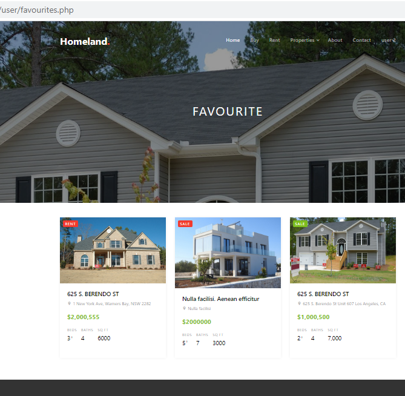
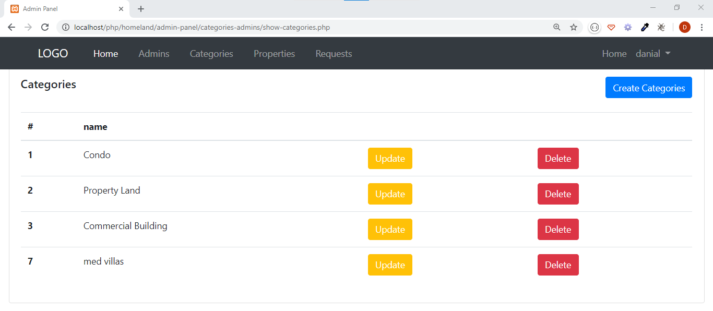

README.md<h3>building a real estate management system</h3>

I used PHP && MySQL
  

And used PDO to connect with the database
  

The home page
  
 
 
 

Register page
  
 

Login page
  
 

Requests page
  
 

favourites page
  
 

Property details page
  
 
 

404 page
  
 

Admin login page
  
 

Admin panel page
  
 

Admins page
  
 

categories page
  
 

Requests show page
  
 

Properties page
  
 

Create property page
  
 

Admin Create page
  
 

